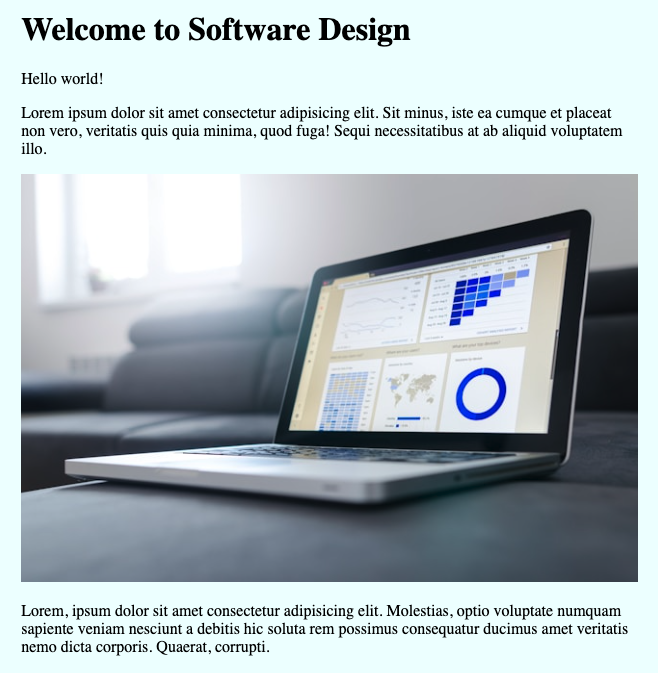

# 3300-flask-template

Starter flask 3.1.0 template

## Installation

1. Create a new virtual environment

   - Windows: `python -m venv ./venv`
   - Mac: `python3 -m venv ./venv`

2. Activate the new virtual environment

   - Windows: `.\venv\Scripts\activate`
   - Mac: `source ./venv/bin/activate`

3. Install the dependencies `pip install -r requirements.txt`  
  

